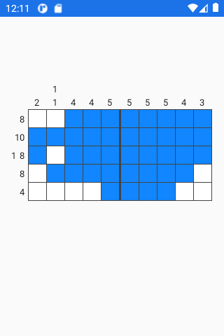

# Nonocross
A simple [nonogram](https://en.wikipedia.org/wiki/Nonogram) puzzle app for Android

# How to play
There are two modes, you can play either a pre-made level or a randomly generated one.

Currently there are very few pre-made levels, so I would recommend the random mode.

# License
This program is Free Software: You can use, study share and improve it at your will. Specifically you can redistribute and/or modify it under the terms of the [GNU General Public License](https://www.gnu.org/licenses/gpl-3.0.html) as published by the Free Software Foundation, version 3 of the License.
